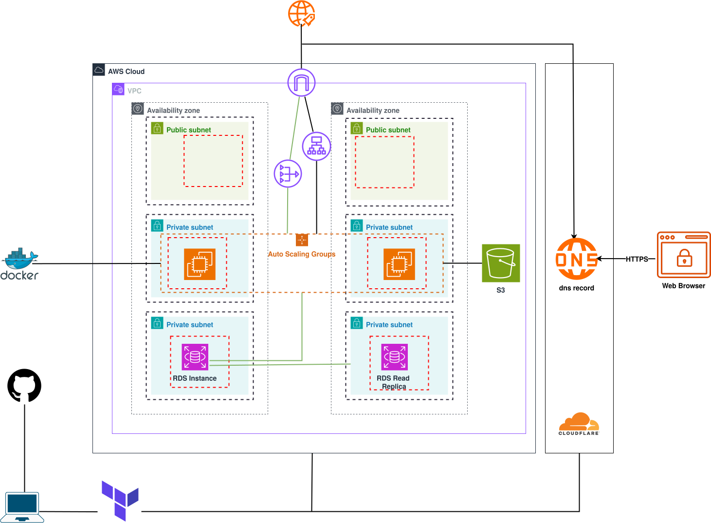
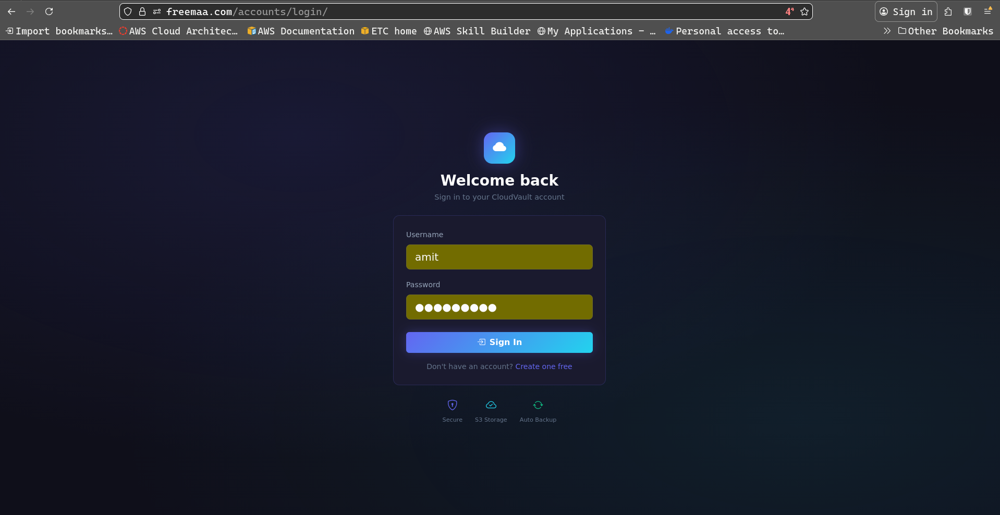
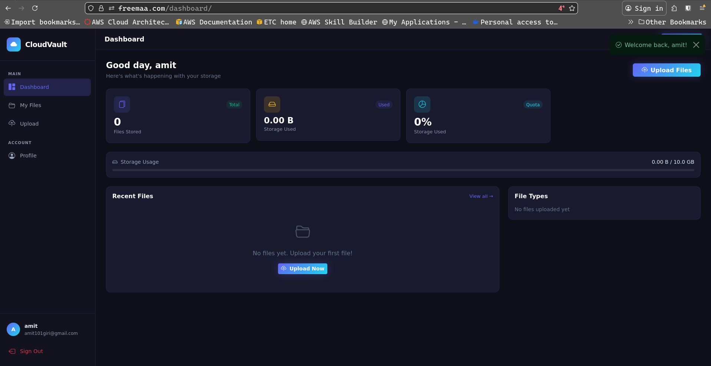

# Demo Application Deployment

This demo application allows users to **register, log in, and upload, download, and delete media files** such as photos, videos, and documents.

The application is deployed using a **highly available three-tier architecture on AWS**, with DNS managed through **Cloudflare** and infrastructure provisioned using **Terraform**.

---

## Deployment Overview



---

## Prerequisites

Before getting started, make sure you have the following:

### 1. AWS CLI installed and configured

```bash
cat ~/.aws/credentials 

[default]
aws_access_key_id=xxxxxxxxxx
aws_secret_access_key=xxxxxxxxxxxxxxxxxxxxxxxxxx
```

### 2. Terraform installed

### 3. Cloudflare credentials

You will need your **Zone ID** and **API Token** (with DNS edit permissions):

```bash
api_token = "xxxxxxxxxxxxxxxxxxxxxxxxxxxxxxxxxxxxxx"
zone_id   = "xxxxxxxxxxxxxxxxxxxx"
```

---

## Setup & Deployment Steps

### 1. Clone the Repository

```bash
git clone https://github.com/amitgiri-13/ThreeTierArchitecture
```

---

### 2. Navigate to the Terraform Directory

```bash
cd ThreeTierArchitecture/terraform
```

---

### 3. Create `variables.tfvars`

Create a file named `variables.tfvars` and provide the required values:

```hcl
# ----------------------------------------------------
# Database Configuration
# ----------------------------------------------------
db_password = "xxxxxxxxx"
db_name     = "cloudvault_db"
db_username = "vault_user"

# ----------------------------------------------------
# Cloudflare Configuration
# ----------------------------------------------------
api_token = "xxxxxxxxxxxxxxxxxxxxxxxxxxxxxxxxxxxxxxx"
zone_id   = "xxxxxxxxxxxxxxxxxxxxxxxxxxxxxxxxxxxxxxx"
```

---

### 4. Update `userdata.sh` (Amazon Linux 2 Example)

 Without updating these values, the infrastructure will deploy successfully, but the application will **not function correctly**.

Replace the placeholders with valid credentials:

```bash
AWS_STORAGE_BUCKET_NAME=cloud-vault-bucket-cloud-storage
AWS_S3_REGION_NAME=us-east-1
AWS_ACCESS_KEY_ID=ASIA5Hxxxxxxxxxxxxxxxxxxxxxxxxxxx
AWS_SECRET_ACCESS_KEY=51ODJoxxxxxxxxxxxxxxxxxxxxxxxxx
AWS_SESSION_TOKEN="IQoJb3J+RuY/pPAzokgd75GWErTcC4vEUGR1dLZxg9Rn2qDHQ1xUhI1QLnvw=="
MAX_UPLOAD_SIZE_MB=100

# Replace with your domains
DOMAIN_1=freemaa.com
DOMAIN_2=www.freemaa.com
```

---

### 5. Initialize Terraform

```bash
terraform init
```

---

### 6. Plan the Infrastructure

```bash
terraform plan --var-file=variables.tfvars
```

---

### 7. Apply the Infrastructure

```bash
terraform apply --var-file=variables.tfvars
```

Type `yes` when prompted.

---

## Access the Application

Once deployment is complete, you can access the application using:

* The **Application Load Balancer DNS** (from Terraform outputs)
* Your **custom domain name** configured through Cloudflare DNS

 Note: It may take a few minutes for DNS propagation and services to become fully available.

---

## Application Screenshots

**Login Page**



**Dashboard**



---

## Cleanup

To destroy all provisioned resources:

```bash
terraform destroy --var-file=variables.tfvars
```

---

## Summary

This project demonstrates how to deploy a **scalable, production-style three-tier web application architecture** using:

* **Amazon Web Services** (compute, networking, storage, database)
* **Terraform** for Infrastructure as Code
* **Cloudflare** for DNS and domain management

---